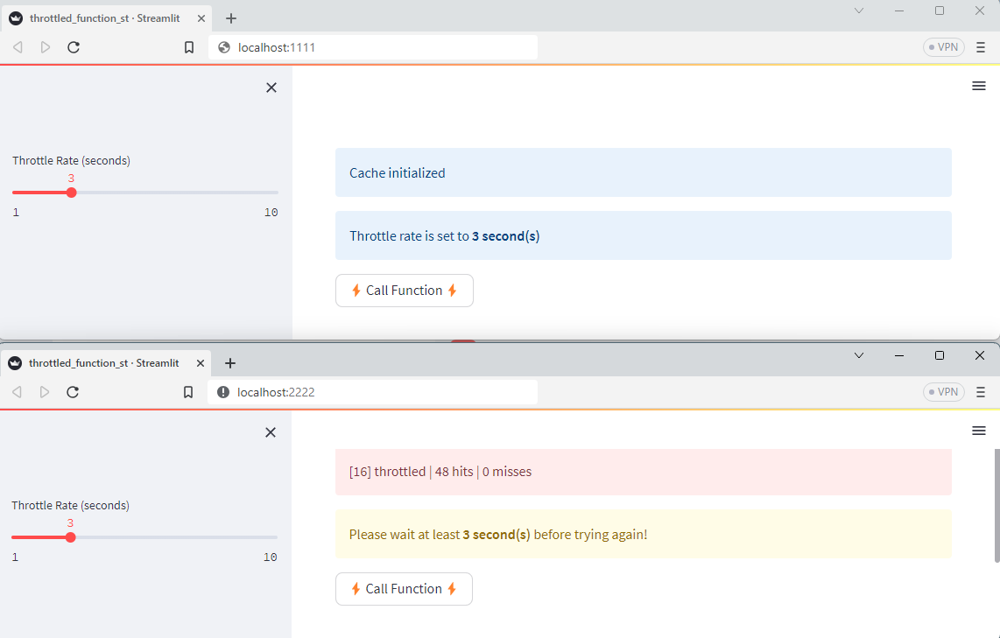
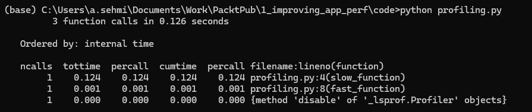
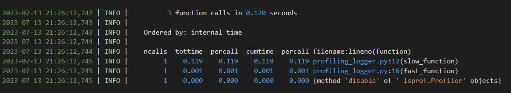

# Improving Streamlit Application Performance

In this chapter, we will explore several key themes that will help improve the performance capabilities of your Streamlit applications. These themes include:

- Caching: We will delve into the effective implementation of caching in Streamlit applications, particularly in scenarios involving expensive data fetching operations, computationally intensive tasks, and model predictions.
- Performance Profiling: Learn how to identify and optimize the most time-consuming parts of your applications using profiling data.
- Asynchronous Programming: Discover how to utilize asynchronous programming techniques to handle IO-bound tasks efficiently.
- Parallel Processing: Leverage parallel processing techniques to distribute computation across multiple cores or machines.
- Git LFS Integration: Explore the integration of Git LFS for handling large files effectively.
- Unused Data Removal: Learn strategies to remove unused data and enhance the overall performance of your applications.

By the end of this chapter, you will have a comprehensive understanding of implementing effective caching, optimizing application performance through profiling and asynchronous programming, utilizing parallel processing, integrating Git LFS, and implementing data cleanup mechanisms. We will provide practical examples, tips, and best practices to help you enhance the responsiveness and performance of your Streamlit applications. Let's dive deeper into each topic and explore how you can apply these techniques in practice.

## Caching Data and Models

Expensive data fetching operations and computationally intensive tasks can have a significant impact on the performance of Streamlit applications. Here are some examples:

- Data processing and manipulation tasks, such as sorting, filtering, or aggregating large datasets, can consume CPU, network, or disk IO resources and slow down the application.
- Retrieving data from a database can be time-consuming, especially when dealing with large amounts of data or complex queries. Additionally, handling large result sets can affect application performance due to memory and disk limitations.
- Running computationally intensive machine learning models, such as training or inference tasks, can strain resources and lead to slower application performance.
- Performing operations on images or videos, like resizing, cropping, or applying filters, can be computationally demanding and impact the application's responsiveness.
- Making requests to external APIs can be slow and susceptible to network issues. High API response times can be attributed to the tasks mentioned earlier, and the situation can be further complicated with multiple parallel API requests.

To enhance the performance of your Streamlit applications, one of the initial steps you can take is implementing caching. In later sections, we will explore additional optimizations such as using asynchronous programming to parallelize tasks and effectively managing large amounts of data, as well as removing unused data from your applications. These optimizations will help improve the overall responsiveness of your Streamlit applications.

### Overview of Caching Techniques

In this section, we will explore different caching techniques for Streamlit applications. We will discuss in-memory caching, disk-based caching, and memoization. While Streamlit provides built-in memoization features for easy caching implementation, we will cover general Python caching techniques that can also be used in Streamlit applications.

Memoization and caching are both techniques used to optimize the performance of programs by reducing redundant computations. While they have similarities, there are some key differences between the two:

**Memoization**

- Memoization is a technique used to optimize functions by caching the results of expensive function calls and returning the cached result when the same inputs are encountered again.
- It is typically implemented within the function being memoized, where a cache (such as a dictionary) is used to store the computed results.
- Memoization is often used with recursive functions or functions with expensive computations, where the same inputs can occur multiple times.
- The cache is usually local to the function and does not persist across multiple invocations of the function.
- Memoization is mainly concerned with optimizing the runtime of a single function.
- Memoization is available natively in Streamlit.

**Caching**

- Caching is a more general technique used to store and retrieve data, not just function results. 
- Caching can be applied to any kind of data or computation, not limited to function calls.
- The cache is typically external to the function being cached, using an external data store or mechanism such as a database, key-value store, or in-memory cache like Redis.
- Caching can be used to store the results of expensive computations, database queries, network requests, or any other form of data that can benefit from being retrieved faster from a cache.
- The cache can be shared across multiple functions or even multiple processes or systems.
- Caching can be used to optimize performance on a wider scale, such as in web applications or distributed systems.

To summarize, memoization is a type of caching that specifically aims to improve the performance of function calls by storing and reusing their results. On the other hand, caching is a broader technique that can be applied to different data or computation scenarios beyond just function calls. While Streamlit's built-in memoization functions may not offer the precise level of control and management needed for your application's caching requirements, you can easily employ a more general approach to achieve the desired results.

### In-Memory Caching

Let's use Python's `functools.lru_cache` to implement an in-memory cache for the return values of expensive functions or methods.

Example 1 demonstrates caching a function using the default configuration of `functools.lru_cache`. This caches the function's return values with an unbounded maximum size and uses a least-recently-used eviction policy. Note, the arguments passed to the cached function must be hashable.

```python
import functools

# Example 1: Caching a Function with Default Configuration
@functools.lru_cache()
def expensive_function(arg1, arg2):
    # Perform expensive computations
    # ...
    return result
```

Example 2 shows caching a function with custom configuration. The `maxsize` argument sets the maximum number of cached values, while `typed` determines whether to treat arguments of different types as distinct cache entries.

```python
# Example 2: Caching a Function with Custom Configuration
@functools.lru_cache(maxsize=128, typed=False)
def expensive_function(arg1, arg2):
    # Perform expensive computations
    # ...
    return result
```

Example 3 demonstrates how to clear the cache of a cached function. Calling `cache_clear()` removes all cached values, allowing the function to recalculate them as needed.

```python
# Example 3: Clearing the Cache
expensive_function.cache_clear()
```

Example 4 showcases accessing cache information using `cache_info()`. It returns a `namedtuple` containing details about the cache, such as the number of hits, misses, and the current cache size.

```python
# Example 4: Accessing Cache Information
cache_info = expensive_function.cache_info()
```

Example 5 illustrates caching a method within a class. The `@functools.lru_cache` decorator can be applied to class methods as well, providing caching benefits for methods that have expensive computations.

```python
# Example 5: Caching a Method
class MyClass:
    @functools.lru_cache()
    def expensive_method(self, arg1, arg2):
        # Perform expensive computations
        # ...
        return result
```

By utilizing `functools.lru_cache`, you can effectively cache the results of expensive function calls, avoiding redundant computations and improving overall performance.

> Technically, these function-caching examples are implementing memoization. 

> The eviction policy in the cache is straightforward and relies solely on the `maxsize` parameter. When the cache reaches its maximum capacity, the least-recently-used cached result is removed first.

> When working with the cached result, it is important to exercise caution because the returned object is the original cached object. Any external modifications made to this object will also impact the cached object. Therefore, while accessing cached objects via `functools.lru_cache` is thread-safe, it's worth considering that the cached objects are mutable, which may not be ideal for certain use cases.

#### In-Memory Caching in Streamlit Applications

To optimize the performance of your Streamlit applications, you can leverage the built-in cache decorators `st.cache_data` and `st.cache_resource`. These decorators serve as highly efficient alternatives to `functools.lru_cache` and offer similar capabilities but are specially designed for optimal performance in Streamlit applications.

Streamlit cache decorators are recommended as they effectively address the performance challenges posed by Streamlit's execution model. By default, Streamlit reruns functions and recreates objects whenever there is a state change during frontend interactions. This can have a detrimental impact on performance, particularly when dealing with resource-intensive operations that involve significant CPU or IO usage.

These decorators are easy to use and require minimal setup. `st.cache_data()` is used for caching data (such as Pandas DataFrames) within an application session, while `st.cache_resource()` is used for caching external resources (such as images or trained machine learning models) across application sessions.

In Example 1, we showcase the caching of a function using the default configuration of `st.cache_data`. This configuration caches the return values of the function without any defined maximum size limit. While there is no specific eviction policy in place, it is vital to note that the cached object's return value is a _copy_. This ensures both thread safety and safeguards the cached objects from external mutations. The determination of cache hits relies on the hashing of the arguments and the serialized code body of the function.

```python
import streamlit as st

# Example 1: Caching a Function with Default Configuration
@st.cache_data()
def expensive_function(arg1, arg2):
    # Perform expensive computations
    # ...
    return result
```

In Example 2, we demonstrate the caching of a function with a custom configuration. By utilizing the `max_entries` argument, you can set the maximum number of cached values allowed. Additionally, the `ttl` (Time to Live) argument, measured in seconds, determines the duration for which cached entries remain before being evicted. If the cache exceeds the specified TTL, the function will be called again to retrieve and cache fresh data. Furthermore, the `show_spinner` argument enables you to control whether a spinner is displayed in the Streamlit user interface while waiting for the cached result.

```python
# Example 2: Caching a Function with Custom Configuration
@st.cache_data(ttl=3600, max_entries=10, show_spinner=False)
def expensive_function(arg1, arg2):
    # Perform expensive computations
    # ...
    return result
```

In Example 3, we illustrate the usage of `st.cache_resource` as a decorator for the `get_model` function, which returns a model resource. Resources are commonly complex and impermanent objects, such as database connections, machine learning models, file handles, threads, and other non-serializable objects. When this function is invoked with the same `model_id`, Streamlit will verify whether the model is already cached. If it is, the cached model will be returned instead of fetching it again. However, if the function is called with a different `model_id`, the cache will be invalidated.

```python
import streamlit as st

# Example 3: Caching a Function returning a Resource Object
@st.cache_resource
def get_model(model_id):
    # Load model using the specified model id
    # ...
    model = load_model(model_id)
    return model

# Example usage
model_id = "acme.com.transformer.model.2727"
model = load_model(model_id)
```

Example 4 demonstrates how to clear the cache of a cached function. Calling `clear()` removes all cached values, allowing the function to recalculate them as needed. This works for functions decorated with either `st.cache_data` or `st.cache_resource`.

```python
# Example 4: Clearing the Cache
expensive_function.clear()
```

> Technically, these Streamlit function-caching examples are implementing memoization.

> In the case of `st.cache_resource`, the cached objects are not serialized or copied upon retrieval. Instead, the cached resource behaves like a global singleton object. Similar to `functools.lru_cache` mentioned earlier, caution should be exercised regarding the mutability and thread-safety of the cached objects. If you're uncertain about which Streamlit cache decorator to use, it is generally recommended to opt for `st.cache_data`.

### Disk-Based Caching

The in-memory caching techniques mentioned earlier have a downside: the cache state is not persistent and is lost in the event of an application failure. To ensure that the cache state survives an application crash, it needs to be persisted to disk. This can be achieved by storing the cache state in a file store or a database. When the crashed application is restarted, the persisted cache state can be restored, allowing the application to continue with the previously cached data.

Persisting the cache state to disk provides several benefits. First, it allows the application to recover from crashes or restarts without losing the cached data. Second, it reduces the time and resources needed to recompute the cache from scratch. Instead, the application can reuse the cached data, improving performance and reducing the load on any external resources or services.

It's important to implement a mechanism to periodically save the cache state to disk to ensure that recent changes are not lost in the event of an application failure. This can be achieved by setting up regular cache state snapshots or using techniques like write-through and write-behind caching to synchronize the in-memory cache with the persisted cache state.

By persisting the cache state to disk, you can add resilience and efficiency to your application by preserving and reusing cached data even after unexpected application failures or restarts.

Disk-based caching is a broader concept than memoization that can be applied to various scenarios beyond just function caching. This includes caching data from various sources, managing data persistence, handling larger volumes of data, and enabling data sharing and reusability across multiple instances of an application.

Several technologies can be considered for implementing a disk-based caching mechanism. The best-suited technology depends on various factors such as the programming language, the type of application, scalability requirements, and performance considerations. Some technologies commonly used for this purpose are: **Redis**, an in-memory data structure store with support for snapshotting cache state to disk, RDB (Redis Database), or AOF (Append-Only File) logs; **Couchbase**, a NoSQL database that supports in-memory caching and disk persistence, with features like automatic cache eviction and consistency models for distributed environments; and **DiskCache**, a Python package that provides a simple and lightweight caching library with built-in disk persistence. It allows you to store data in-memory for faster access and automatically saves the cache state to disk to ensure durability.

We'll take a look at a few examples of disk-based caching using DiskCache because it is easy to use, and in keeping with the low-complexity, low-code ethos of Streamlit application development.

The following examples require installation of DiskCache. If it is not already available in your Python distribution run the following commands in your console:

```bash
# Check for DiskCache installation
$ pip show diskcache

# Install DiskCache if required
$ pip install diskcache
```

Example 1 shows how to use `diskcache` for general caching to a file store.

> Behind the scenes, DiskCache uses Python's built-in SQLite database as a file store.

You create a `cache` object by specifying the directory path where the cache data will be stored. You can then use `set()` to store data in the cache, `get()` to retrieve data from the cache, and `delete()` to delete data from the cache. Finally, you need to close the cache using `close()` to release any resources held by the cache.

```python
# Example 1: General-Purpose Disk Cache with Default Configuration
import diskcache as dc

# Create a cache object
cache = dc.Cache("./cache")
# Store data in the cache
cache.set("key", "value")

# Retrieve data from the cache
data = cache.get("key")
if data is not None:
    print(data)
else:
    print("Not found in cache")

# Delete data from the cache
cache.delete("key")
# Close the cache to release resources
cache.close()
```

Example 2 shows the `@cache.memoize()` decorator applied to the `expensive_function()`. This tells `diskcache` to memoize the function and cache its results based on the input arguments. When the function is called with the same arguments, the cached result is returned instead of recomputing the function. This can be used to optimize functions with long and repetitive computations.

```python
# Example 2: Memoizing an Expensive Function
import diskcache as dc

# Create a cache object
cache = dc.Cache("./cache")

# Define a function to be memoized
@cache.memoize()
def expensive_function(n):
    print("Computing...")
    # Perform expensive computation here
    result = n ** 2
    return result

# Call the memoized function
print(expensive_function(2))  # Computation is performed
print(expensive_function(2))  # Cached result is returned
print(expensive_function(7))  # Computation is performed
print(expensive_function(7))  # Cached result is returned

# Close the cache to release resources
cache.close()
```

The DiskCache package has additional features beyond simple caching, such as:

1. Expiration: `diskcache` allows you to set an expiration time for cached items. You can use the `expire` parameter to specify the maximum time an item should stay in the cache. For example:

```python
cache.set("key", "value", expire=60)  # Set an expiration time of 60 seconds
```

You can use the `expire` parameter in the memoizing decorator. The arguments to memoize are like those for `functools.lru_cache` discussed earlier.

```python
@cache.memoize(typed=True, expire=1)
def fibonacci(number):
    if number == 0:
        return 0
    elif number == 1:
        return 1
    else:
        return fibonacci(number - 1) + fibonacci(number - 2)
```

2. Cache Size Limit: You can set a maximum size limit for the cache using the `size_limit` parameter when creating the cache object. For example:

```python
cache = dc.Cache("/path/to/cache/directory", size_limit=100_000_000)  # Set a cache size limit of 100MB
```

3. Cache Persistence: By default, `diskcache` uses a SQLite database storage backend. However, you can specify other permanent storage backends, such as using JSON serialization with zlib compression, to persist the cache across multiple sessions or applications by using the `disk` parameter when creating the cache object. For example:

```python
cache = dc.Cache("/path/to/cache/directory", disk=dc.JSONDisk)  # Use JSONDisk storage backend for persistence
```

4. Cache Statistics: `diskcache` provides methods to retrieve statistics about the cache, such as the current size, disk consumption, and hit/miss values. For example:

```python
cache.size              # Get the number of items in the cache
cache.volume()          # Get estimated total size of cache on disk
cache.stats.enable()    # Enable cache hit/miss statistics collection
cache.hits              # ... then get the number of cache hits
cache.misses            # ... or get the number of cache misses
```

These are just a few examples of the features and functionalities offered by DiskCache. The package provides a rich set of methods and options for fine-tuning caching behavior and optimizing cache performance in terms of cache configuration, custom serialization, cache expiration, and cache size management. Please refer to the [DiskCache documentation](https://grantjenks.com/docs/diskcache/) for more details on the available features and usage instructions.

> DiskCache can be used for a wide range of caching scenarios beyond Streamlit applications and you should try using it if Streamlit's built-in cache decorators can't meet your specific requirements.

#### Disk-Based Caching in Streamlit Applications

The built-in cache decorators, `st.cache_data` and `st.cache_resource`, provide the option to specify the `persist` parameter. By default, the `persist` parameter is set to `None`, indicating that caching is performed entirely in-memory. With the default setting, any data or resources that are cached using these decorators will be stored and retrieved from memory. This means that the cached items will be available as long as the application is running and the cache has not been cleared.

To enable persistence for cached data or resources you set the `persist` parameter to `True` (or `"disk"`). When the `persist` parameter is set cached items will be stored not only in memory but also to local disk. There is no option to control the persistence path, as there is with DiskCache.

Example 1 shows caching a function configured with `persist` set to `True` which persists cached data to local disk. You have the flexibility to choose whether to perform caching solely in-memory or to enable persistence for caching. Together with `ttl` and `max_entries` parameters you can optimize the caching strategy based on the longevity and availability requirements of the cached items.

```python
# Example 1: Caching a Function with Local Disk Persistence
@st.cache_data(persist=True, ttl=3600, max_entries=10)
def expensive_function(arg1, arg2):
    # Perform expensive computations
    # ...
    return result
```

In some cases, when using Streamlit's `st.cache_data` function, you may encounter issues when trying to cache functions with arguments or code that isn't hashable. To address this, Streamlit provides a `hash_funcs` parameter that allows you to define custom hash functions for specific types or fully qualified names. This way, you can override Streamlit's default hashing mechanism and enable caching of unhashable objects and code.

To understand how to use `hash_funcs`, it is recommended to refer to Streamlit's [comprehensive documentation on caching](https://docs.streamlit.io/library/advanced-features/caching). The documentation provides detailed explanations and examples on how to utilize `hash_funcs` to handle unhashable objects and code.

Additionally, Streamlit's cache functions have a specific behavior where function parameters prefixed with an underscore ('_') are not included in the hashing process. This means that if the unhashable object or code is associated with a function parameter that has a leading underscore, it may be a quicker fix to prefix the parameter's name with an underscore rather than defining custom `hash_funcs` mappings.

By leveraging the `hash_funcs` parameter and taking advantage of the omission of underscore-prefixed parameters from hashing, you can effectively handle situations where function arguments or code are not hashable and still utilize Streamlit's caching capabilities.

> In the section on parallel processing techniques, we will revisit DiskCache and explore how to use `diskcache.Deque` for communication between data producers and consumers running in separate threads (or separate processes). Additionally, we will discuss the integration of this functionality into Streamlit.

Before we move on to the next section, let's explore an interesting use case of DiskCache called throttling. Throttling involves using a cached semaphore to determine whether or not to throttle resource access. This is easy to implement using Streamlit's cache in a standalone application, but becomes more challenging if the cached semaphore needs to be shared across multiple applications.

Throttling is an important technique for optimizing performance. It allows us to control the rate at which actions or operations are executed, ensuring efficient resource usage, load balancing, rate limiting, and protection against abuse or attacks.

In Example 3, we use `diskcache` to throttle a function by limiting the rate at which it can be called. Since the cache is stored on disk, it can be shared between applications. This capability can be utilized to control the rate at which a user performs an action in your _standalone_ Streamlit application, for instance the rate at which API calls are made to an external web service. Additionally, it can also be used within the the external web service to throttle access by multiple client applications (e.g., by multiple _standalone_ Streamlit applications), which is particularly useful.

```python
# Example 3: Throttled Streamlit Application Function
import time
import diskcache as dc

import streamlit as st

message = st.empty()
sub_message = st.empty()

@st.cache_resource
def init_cache() -> dc.Cache:
    # Create a cache object
    cache = dc.Cache("./cache")
    print(f"Cache cleared: {cache.clear(retry=True)} items removed")
    cache.stats(reset=True)
    if not (throttle_rate := cache.get("throttle_rate")):
        cache.set("throttle_rate", 1)
    if not (counter := cache.get("counter")):
        cache.set("counter", 1)
    return cache

# Initialize the DiskCache cache, memoized as a Streamlit cached resource
cache: dc.Cache = init_cache()
message.info("Cache initialized")

# Define the throttle rate (in seconds)
throttle_rate = st.sidebar.slider("Throttle Rate (seconds)", 1, 10, cache.get("throttle_rate"))
cache.set("throttle_rate", throttle_rate)
sub_message.info(f'Throttle rate is set to **{throttle_rate} second(s)**')

# Define the function to be throttled
@cache.memoize()
def throttled_function(arg1, arg2):
    # Perform some action here
    return (arg1, arg2)

# Throttle the function execution
def throttle(counter):
    (hits, misses) = cache.stats()
    last_call_time = cache.get("last_call_time")
    current_time = time.time()
    if last_call_time is None or current_time - last_call_time >= throttle_rate:
        # Call the throttled function
        throttled_function(1,2)
        # Get the number of cache hits
        if hits > 0:
            msg = f"[{counter}] cache hit | {hits} hits | {misses} misses"
            message.info(msg)
            print(msg)
        else:
            msg = f"[{counter}] memoized | {hits} hits | {misses} misses"
            message.success(msg)
            print(msg)
        # Update the last call time in the cache
        cache.set("last_call_time", current_time)
    else:
        msg = f"[{counter}] throttled | {hits} hits | {misses} misses"
        message.error(msg)
        sub_message.warning(f"Please wait at least **{throttle_rate} second(s)** before trying again!")
        print(msg)
        cache.stats(reset=True)

if st.button('⚡Call Function⚡'):
    message.empty()
    sub_message.empty()
    counter = cache.get("counter")
    # Call the throttle function multiple times
    throttle(counter)
    cache.set("counter", counter + 1)
```

Explanation:

- This program imports the necessary libraries and initializes the Streamlit interface by creating empty `message` and `sub_message` components.
- The `init_cache` function is defined and wrapped with the `@st.cache_resource` decorator, which means that it will be treated as a Streamlit cached resource. The function creates a DiskCache object and initializes it with a cache directory. The cache is then cleared and its statistics are reset. A cached counter and cached throttle rate are initialized. The cache object is returned and stored in the `cache` variable. A message is displayed to indicate that the cache has been initialized.
- The program also includes a slider in the sidebar to set the throttle rate (the time interval between function calls). The slider value is initialized from the cached throttle rate. The selected throttle rate is updated in the cache and is displayed in the `sub_message` component.
- Next, the `throttled_function` is defined and memoized using the cache object. This means that the function's results will be stored in the cache for future use.
- The main function of the program is the `throttle` function, which takes a `counter` as input. It first retrieves the cache statistics, the throttle rate, and the last call time from the cache. Then, it checks if the throttle rate has been exceeded by comparing the current time with the last call time. If the throttle rate has not been exceeded, the throttled function is called, and the cache statistics are updated accordingly. If the throttle rate has been exceeded, an error message is displayed and the cache statistics are reset.
- The program also includes a button that triggers the throttle function when clicked. When the button is clicked, the throttle function is called with the counter value obtained from the cache. The counter value is incremented and updated in the cache.

> The DiskCache we created is a shared resource because it is configured to point to a single file store. As a result, it can be _utilized by multiple Streamlit applications simultaneously_. This means that any cached values used in these Streamlit applications will remain synchronized. Achieving this desirable outcome is made possible by this simple use of DiskCache.

To demonstrate that the DiskCache cache is a shared resource across multiple instances of the Streamlit application, ensuring synchronization of any cached values used in these applications, let's run two instances of the application from the command line:

```bash
# In one terminal window (port 1111)
$ streamlit run --server.port 1111 throttled_function_st.py
# In another terminal window (port 2222)
$ streamlit run --server.port 2222 throttled_function_st.py
```

Here's what you should observe:



Click on the button to invoke the throttled function and adjust the throttle rate slider. Do this multiple times and alternately in both application instances. Messages will appear in the application regarding cache initialization, function call throttling, and function call hits. Notably, any changes made to the throttle rate value and counter updates will be synchronized across both applications through the cache.

## Profiling Application Performance

This section will focus on the significance of profiling to identify
performance bottlenecks in Streamlit applications. It will explain various
profiling techniques and tools that can be used to measure the application's
performance. The section will guide you on how to identify and
optimize the most time-consuming parts of your application using profiling
data. It will provide practical examples and best practices for
profiling Streamlit applications effectively.

### Importance of profiling for identifying performance bottlenecks

Using profiling is crucial for identifying performance bottlenecks in your code because it allows you to gather detailed information about how your program is executing and how much time is being spent in each part of your code. By systematically profiling your code, you can:

1. Identify areas of your code that consume the most CPU time or have a high memory footprint. This helps you focus your optimization efforts on the most critical parts of your codebase.
2. Pinpoint specific functions, methods, or lines of code that are causing performance issues. Profiling reveals which parts of your code are taking the most time to execute, allowing you to isolate problematic areas.
3. Understand the call hierarchy and interactions between different parts of your code. Profiling enables you to see how functions or methods are being called and how they relate to each other, helping you uncover hidden performance issues caused by suboptimal interactions.
4. Validate the impact of optimization efforts. Profiling helps you assess the effectiveness of your optimization strategies by providing concrete measurements of performance improvements or regressions.

Overall, profiling is a powerful tool for analyzing the performance characteristics of your code and enables you to make informed decisions when optimizing performance. It helps you identify inefficiencies, prioritize optimization efforts, and ultimately deliver a faster and more efficient software solution.

### Using cProfile to profile a Streamlit Application

The profiling tools `cProfile` and `line_profiler` can be used to identify the slowest parts of your code. This will enable you to focus your optimization efforts on the critical sections of your code which may have performance issues.

Example 1 shows you how to use `cProfile` to profile your Python code and identify performance bottlenecks. Similar code can of course be used to profile your Streamlit applications.

`cProfile` is a built-in module in Python, so it does not require any additional installation. It is available by default in the Python standard library. You can simply import the `cProfile` module in your Python script without any extra steps.

```python
# Example 1: Simple Code Profiling
import cProfile
import pstats

def slow_function():
    for _ in range(10000000):
        pass

def fast_function():
    for _ in range(100000):
        pass

def main():
    # Create a profile object
    profiler = cProfile.Profile()
    # Start profiling
    profiler.enable()
    # Run your code
    slow_function()
    fast_function()
    # Stop profiling
    profiler.disable()
    # Create a statistics object from the profiler
    stats = pstats.Stats(profiler)
    # Print the statistics by function name
    stats.strip_dirs().sort_stats('tottime').print_stats()

if __name__ == "__main__":
    main()
```

The mentioned code snippet showcases the usage of profiling to analyze the performance of two sample functions: `slow_function` and `fast_function`. To begin profiling, a `cProfile.Profile` object named `profiler` is created. Profiling is started by invoking `profiler.enable()`. Once `slow_function` and `fast_function` have completed execution, profiling is halted using `profiler.disable()`.

To display the profiling statistics, a `pstats.Stats` object named `stats` is created. The function `stats.strip_dirs().sort_stats('tottime').print_stats()` is used to print the statistics sorted by total time, excluding time spent in sub-functions, and removing directory information from filenames. The output generated by the aforementioned code will resemble the following:

<!--
| 3 function calls in 0.121 seconds<br/>Ordered by: internal time ||||||
|-|-|-|-|-|-|
|ncalls | tottime | percall | cumtime | percall | filename:lineno(function)|
|    1  |  0.120  |  0.120  |  0.120  |  0.120  | profiling.py:4(slow_function)|
|    1  |  0.001  |  0.001  |  0.001  |  0.001  | profiling.py:8(fast_function)|
|    1  |  0.000  |  0.000  |  0.000  |  0.000  | {method 'disable' of '_lsprof.Profiler' objects}|
-->
<!-- 
```code
3 function calls in 0.121 seconds
Ordered by: internal time

ncalls  tottime  percall  cumtime  percall filename:lineno(function)
     1    0.120    0.120    0.120    0.120 profiling.py:4(slow_function)
     1    0.001    0.001    0.001    0.001 profiling.py:8(fast_function)
     1    0.000    0.000    0.000    0.000 {method 'disable' of '_lsprof.Profiler' objects}
```
-->



This output provides information about the number of function calls (in this case, 3), the total time spent in each function, and the cumulative time. The `tottime` column represents the total time spent in the function itself, excluding time spent in sub-functions, and the `ncalls` column identifies those that are called most frequently. Together this information helps you pinpoint potential performance bottlenecks in your code.

> Note that `cProfile` provides more advanced options and ways to analyze the profiling results. You can explore the `pstats` module documentation for additional functionality, such as filtering and sorting options, to dive deeper into the profiling data.

Example 2 introduces logging to the first example. When profiling applications that run over long periods and/or its inconvenient to look at a waterfall of console output, you're better off logging the output to a log file that can be viewed and analysed at a later time.

```python
# Example 2: Simple Code Profiling with Persistent Logging
import io
import cProfile
import logging
import pstats

# Configure logging to your cloud-based logging service
logging.basicConfig(level=logging.INFO)
logger = logging.getLogger("cProfile")
logger.setLevel(logging.INFO)
formatter = logging.Formatter('%(asctime)s | %(levelname)s | %(message)s')

def slow_function():
    for _ in range(10000000):
        pass

def fast_function():
    for _ in range(100000):
        pass

def main():
    # Create a profile object
    profiler = cProfile.Profile()

    # Start profiling
    profiler.enable()

    # Run your code
    slow_function()
    fast_function()

    # Stop profiling
    profiler.disable()

    # Create a stream handler to log to the console
    stream_handler = logging.StreamHandler()
    stream_handler.setLevel(logging.INFO)
    stream_handler.setFormatter(formatter)
    logger.addHandler(stream_handler)

    # Create a file handler to log to a file
    log_file = './logs/stats.log'
    file_handler = logging.FileHandler(log_file, mode='w')
    file_handler.setLevel(logging.INFO)
    file_handler.setFormatter(formatter)
    logger.addHandler(file_handler)

    # Create a statistics object from the profiler
    stats_stream = io.StringIO()
    stats = pstats.Stats(profiler, stream=stats_stream)

    # Print the statistics by function name
    # (output will be redirected to the stream buffer)
    stats.strip_dirs().sort_stats('tottime').print_stats()

    # Split the stats string into lines and log each line
    for line in stats_stream.getvalue().split('\n'):
        logger.info(line.rstrip())
        
if __name__ == "__main__":
    main()
```

In the code above, the logger is set up with two handlers: `stream_handler` for logging to the console and `file_handler` for logging to a file. Both handlers are configured with the same log level and formatter. The `pstats.Stats` object is configured with an additional `stream` parameter to redirect statistics output to the `StringIO` object, `stats_stream`. After statistics have been captured in `stats_stream` they are split into lines, and each line is logged to both the console and the specified log file using the `logger.info()` method.

The console and file output generated by the aforementioned code will resemble the following:

<!--
<span style="font-family:Courier; font-size:0.75em;">
2023-07-13 21:26:12,742 | INFO |          3 function calls in 0.120 seconds<br/>
2023-07-13 21:26:12,743 | INFO |    Ordered by: internal time<br/>
2023-07-13 21:26:12,744 | INFO | <br/>
2023-07-13 21:26:12,744 | INFO |    ncalls  tottime  percall  cumtime  percall filename:lineno(function)<br/>
2023-07-13 21:26:12,745 | INFO |         1    0.119    0.119    0.119    0.119 profiling_logger.py:12(slow_function)<br/>
2023-07-13 21:26:12,745 | INFO |         1    0.001    0.001    0.001    0.001 profiling_logger.py:16(fast_function)<br/>
2023-07-13 21:26:12,745 | INFO |         1    0.000    0.000    0.000    0.000 {method 'disable' of '_lsprof.Profiler' objects}
</span>
-->
<!--
```code
2023-07-13 21:26:12,742 | INFO |          3 function calls in 0.120 seconds
2023-07-13 21:26:12,743 | INFO | 
2023-07-13 21:26:12,743 | INFO |    Ordered by: internal time
2023-07-13 21:26:12,744 | INFO | 
2023-07-13 21:26:12,744 | INFO |    ncalls  tottime  percall  cumtime  percall filename:lineno(function)
2023-07-13 21:26:12,745 | INFO |         1    0.119    0.119    0.119    0.119 profiling_logger.py:12(slow_function)
2023-07-13 21:26:12,745 | INFO |         1    0.001    0.001    0.001    0.001 profiling_logger.py:16(fast_function)
2023-07-13 21:26:12,745 | INFO |         1    0.000    0.000    0.000    0.000 {method 'disable' of '_lsprof.Profiler' objects}
```
-->



An obvious flaw in Examples 1 and 2 is that profile stats are displayed after all the work is completed in `slow_function` and `fast_function`. Ideally, the profile statistics should be captured and output as the work is being performed. The next example will show an implementation to do this.

Example 3 is an improved version of Example 2 adding a `profile_and_log_stats` function that is called periodically within `slow_function` and `fast_function`:

```python
import io
import time
import cProfile
import logging
import pstats

# Configure logging to your cloud-based logging service
logging.basicConfig(level=logging.INFO)
logger = logging.getLogger("cProfile")
logger.setLevel(logging.INFO)
formatter = logging.Formatter('%(asctime)s | %(levelname)s | %(message)s')

# Create a file handler to log to a file
log_file = './logs/checkpoint_stats.log'
file_handler = logging.FileHandler(log_file, mode='w')
file_handler.setLevel(logging.INFO)
file_handler.setFormatter(formatter)
logger.addHandler(file_handler)

def slow_function(profiler, n_iterations=100_000_000, n_checkpoint=50_000_000):
    assert(n_checkpoint <= n_iterations)
    
    for i in range(n_iterations):
        # Perform your task here
        # ...
        # Call profile_and_log_stats every  iterations
        if (i+1) % n_checkpoint == 0:
            profile_and_log_stats(profiler)
    
    # Generate and log the final statistics
    profile_and_log_stats(profiler)

def fast_function(profiler, n_iterations=1_000_000, n_checkpoint=50_000):
    assert(n_checkpoint <= n_iterations)
    
    for i in range(n_iterations):
        # Perform your task here
        # ...
        # Call profile_and_log_stats every 50,000 iterations
        if (i+1) % n_checkpoint == 0:
            profile_and_log_stats(profiler)
    
    # Generate and log the final statistics
    profile_and_log_stats(profiler)

def profile_and_log_stats(profiler):
    profiler.disable()

    # Create a statistics object from the profiler
    stats_stream = io.StringIO()
    stats = pstats.Stats(profiler, stream=stats_stream)

    # Print the statistics by function name
    # (output will be redirected to the stream buffer)
    stats.strip_dirs().sort_stats('tottime').print_stats()

    # Split the stats string into lines and log each line
    for line in stats_stream.getvalue().split('\n'):
        logger.info(line.rstrip())

    profiler.enable()

if __name__ == "__main__":
    with cProfile.Profile(subcalls=False, builtins=False) as global_pr:
        global_pr.enable()

        with cProfile.Profile(subcalls=False, builtins=False) as local_pr:
            local_pr.enable()
            slow_function(local_pr, n_checkpoint=50_000_000)
            local_pr.disable()

        with cProfile.Profile(subcalls=False, builtins=False) as local_pr:
            local_pr.enable()
            fast_function(local_pr, n_checkpoint=500_000)
            local_pr.disable()

        profile_and_log_stats(global_pr)
        
        global_pr.disable()
```

The code in Example 3 utilizes a separate `cProfile.Profile` object instance per function, allowing for local capture of statistics within each function. These statistics can then be periodically saved to a checkpoint log file using `logging.FileHandler` after every `n_checkpoint` iterations.

The console and file output generated by the provided code is similar to the previous output. By configuring `cProfile.Profile` to omit statistics for sub-procedure calls and built-in Python functions, the output becomes more concise. This conciseness is valuable considering the potentially larger amount of output generated in this continuous profiling implementation.

By incorporating the `profile_and_log_stats` function into the functions themselves and calling it every `n_checkpoint` iterations, you can adjust the granularity of profiling information during the execution of the functions based on your specific requirements.

> Cloud SaaS logging services offer various features and capabilities for centralized log management, analysis, and monitoring. It's very easy using their Python SDKs to extend the examples above to log profile information to these services. Try experimenting with the Python SDKs for these services: [Sentry.io](https://docs.sentry.io/platforms/python/) | [Logz.io](https://logz.io/blog/python-custom-metrics-remotewrite-sdk/) | [Datadog Logging](https://docs.datadoghq.com/logs/log_collection/python/).

### Explanation of line_profiler and its benefits for detailed code profiling

Integration of line_profiler with Streamlit applications for fine-grained
performance analysis

Profiling Best Practices

### Best practices and tips for effective profiling in Streamlit applications

Interpreting profiling results and prioritizing optimizations

When doing ....

The general rule of thumb for ... can be broken down into the following
steps...

Note

In this recipe we will...

### Setup // Getting ready...

Getting ready // system config // code config // etc.

### How to do it...

Step by step solution

### How it works...

Describe what the code does.

### There's more...

Areas to expand the code and concerns.

### See also...

GitHub source link and additional resources

## Pre-Processing and Pre-Calculating Data Inputs

This section will discuss the concept of pre-calculating inputs and
cache to improve Streamlit application performance. It will explain how to
identify inputs or computations that can be pre-calculated and stored in
a cache. The section will provide step-by-step instructions on
implementing pre-calculation and caching strategies in Streamlit applications.
It will cover scenarios where pre-calculating inputs and cache can
significantly enhance the responsiveness of the application.

Introduction to the topic // situation // problem

Introduction to Pre-Calculation and Cache in Streamlit Applications

### Understanding the concept of pre-calculation and caching for performance improvement

Advantages and use cases of pre-calculating inputs and cache

Identifying Inputs and Computations for Pre-Calculation

### Strategies for identifying inputs or computations that can be pre-calculated

Techniques for determining the frequency of updates to make informed
caching decisions

Implementing Pre-Calculation and Caching Techniques

### Step-by-step instructions for implementing pre-calculation and caching in Streamlit applications

Integration of memoization or persistent caching strategies

Handling Updates and Invalidating Cache

### Strategies for managing updates to pre-calculated inputs or cached data

Techniques to invalidate cache appropriately to ensure data integrity

When doing ....

The general rule of thumb for ... can be broken down into the following
steps...

Note

In this recipe we will...

### Setup // Getting ready...

Getting ready // system config // code config // etc.

### How to do it...

Step by step solution

### How it works...

Describe what the code does.

### There's more...

Areas to expand the code and concerns.

### See also...

GitHub source link and additional resources

## Using asynchronous programming techniques to handle IO-bound tasks efficiently

Introduction to the topic // situation // problem

When doing ....

The general rule of thumb for ... can be broken down into the following
steps...

Note

In this recipe we will...

### Setup // Getting ready...

Getting ready // system config // code config // etc.

### How to do it...

Step by step solution

### How it works...

Describe what the code does.

### There's more...

Areas to expand the code and concerns.

### See also...

GitHub source link and additional resources

## Leverage parallel processing techniques to distribute computation across multiple cores or machines

Introduction to the topic // situation // problem

When doing ....

The general rule of thumb for ... can be broken down into the following
steps...

Note

In this recipe we will...

### Setup // Getting ready...

Getting ready // system config // code config // etc.

### How to do it...

Step by step solution

### How it works...

Describe what the code does.

### There's more...

Areas to expand the code and concerns.

### See also...

GitHub source link and additional resources

## Using Git LFS for Large Files {#using-git-lfs-for-large-files-1}

This section will highlight the challenges and potential performance
issues associated with handling large files in Streamlit applications. It will
introduce Git LFS (Large File Storage) as a solution for efficiently
managing large files. The section will provide instructions on
integrating Git LFS into a Streamlit application workflow and best practices for
handling large files effectively. It will also discuss alternative
approaches for handling large files, such as cloud storage solutions.

Introduction to the topic // situation // problem

Challenges of Handling Large Files in Streamlit Applications

Discussion on the impact of large files on application performance and version
control

### Introduction to Git LFS as a solution for managing large files

Integrating Git LFS into the Streamlit Workflow

### Step-by-step guide on setting up and integrating Git LFS with Streamlit applications

Best practices for storing and accessing large files in the application

Alternative Approaches for Large Files

### Overview of alternative solutions for handling large files in Streamlit applications

Comparison of cloud storage options and their integration with Streamlit

When doing ....

The general rule of thumb for ... can be broken down into the following
steps...

Note

In this recipe we will...

### Setup // Getting ready...

Getting ready // system config // code config // etc.

### How to do it...

Step by step solution

### How it works...

Describe what the code does.

### There's more...

Areas to expand the code and concerns.

### See also...

GitHub source link and additional resources

## Removing Unused Data {#removing-unused-data-1}

This section will emphasize the importance of periodically removing
unused data to optimize Streamlit application performance. It will discuss
various types of data that can accumulate over time, including temporary
files, cached data, and outdated models. The section will provide
guidance on implementing data cleanup strategies to free up resources
and enhance the overall performance of the application. It will cover
considerations such as data retention policies, automated cleanup
mechanisms, and the impact of removing data on the application's functionality.

Introduction to the topic // situation // problem

Importance of Data Cleanup for Streamlit Application Performance

### Explanation of the impact of accumulated unused data on application performance

Discussion on the benefits of periodic data cleanup

Identifying Unused Data

### Techniques for identifying temporary files, cached data, and outdated models

Strategies to determine data retention policies for effective cleanup

Implementing Data Cleanup Mechanisms

### Step-by-step instructions for implementing automated data cleanup in Streamlit applications

Tools and libraries that can assist in efficient data cleanup

### Considerations and Potential Risks

Discussing potential risks and considerations when removing unused data

Balancing data cleanup with the application's functionality and data integrity

When doing ....

The general rule of thumb for ... can be broken down into the following
steps...

Note

In this recipe we will...

### Setup // Getting ready...

Getting ready // system config // code config // etc.

### How to do it...

Step by step solution

### How it works...

Describe what the code does.

### There's more...

Areas to expand the code and concerns.

### See also...

GitHub source link and additional resources

---

# Chapter Title

In this chapter, we will cover the basics of...

Upon completion you will understand...

This chapter comprises the following parts... // The main themes of this
chapter are...

## Section Title

Introduction to the topic // situation // problem

When doing ....

The general rule of thumb for ... can be broken down into the following
steps...

Note

In this recipe we will...

### Setup // Getting ready...

Getting ready // system config // code config // etc.

### How to do it...

Step by step solution

### How it works...

Describe what the code does.

### There's more...

Areas to expand the code and concerns.

### See also...

GitHub source link and additional resources
