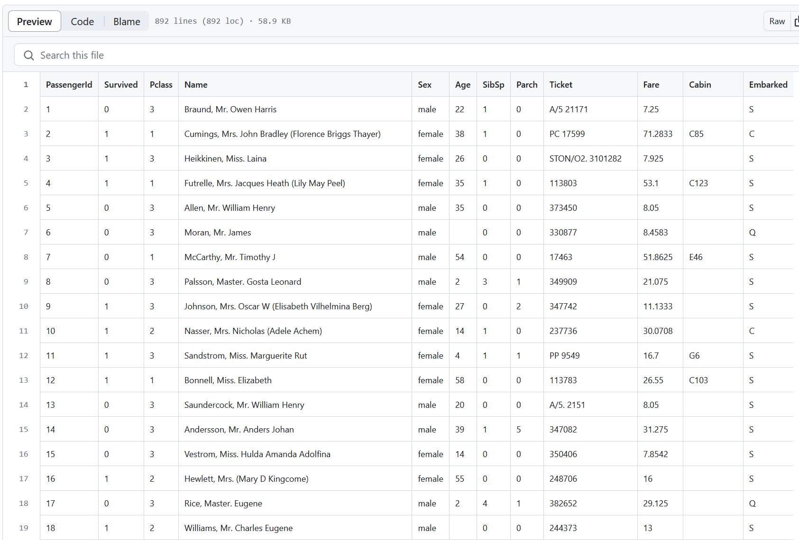

# Chapter 5: Working with Data

In this chapter, we will be working with data in Streamlit. This chapter presumes that the reader has familiarity with Pandas, a common data science Python library for loading and processing data. Streamlit is designed to work seamlessly with data in a Pandas `DataFrame`, the chief way data is loaded and manipulated in the library.

One of Streamlit's greatest strengths is being able to quickly demonstrate a prototype for a concept or idea. Another strength of Streamlit is being able to reveal a dataset and allow users to study, manipulate, and download that data.

Throughout this chapter, we will learn how to load a Pandas DataFrame in a Streamlit application. We will then dive into how we can use Streamlit and Pandas to manipulate that data via user inputs. We will specifically look at how to work with missing and redundant data; we will explore how we can let the user filter, sort, aggregate, and transform that data.

One of the key limitations of this chapter is that it cannot cover all ways to manipulate data in Streamlit. No two datasets are alike and there are myriad of ways to manipulate each dataset. Instead, this chapter will provide you with the fundamental concepts for manipulating data in Python and sample code for implementing this via Streamlit. These should serve as models for you to apply to your own data.

## About the Dataset

We will be working with the popular Titanic Dataset. It is a collection of data about those aboard the Titanic. The dataset contains important data for each person, such as their ticket class (string), gender (binary string of male or female), age (float because some persons were children and they are represented as decimal points), etc. It is often used in machine learning tutorials to train a predictive model that can determine which features of the data best predict the chance of survival of a fictional passenger.



This dataset is well suited to this chapter because it offers a variety of types of data, it is publicly available, familiar to most data scientists, and suffers from issues such as missing data. In the remaining portions of this chapter, we will learn how to leverage Streamlit to handle all data processing via user inputs.

To download this dataset, we can do so with the following Python:

```python
# Import pandas library, which provides data structures and data analysis tools
import pandas as pd

# Define the URL of the CSV file located in the GitHub repository. This URL points to the raw version of the file.
url = 'https://raw.githubusercontent.com/datasciencedojo/datasets/master/titanic.csv'

# Use pandas' read_csv function to read the CSV file directly from the URL and convert it into a DataFrame.
data = pd.read_csv(url)

# Save the DataFrame as a CSV file named 'titanic.csv' in the current working directory.
# The argument index=False prevents pandas from writing row indices into the CSV file.
data.to_csv('titanic.csv', index=False)
```

## Displaying Data

In the following application, we can load our data as a CSV with Pandas. In the commented out section, you also have the code for working with the data from the original GitHub repository. To display the  data with little control over how it is displayed, we can use the standard `st.write()` function. This will default to `st.dataframe()` automatically. If your goal is to display data quickly, this is an easy-to-read and easy-to-write apprach.

### st.write()
```python
import streamlit as st
import pandas as pd

st.title("Demo App for Titanic Dataset")

## Download the Data
## Define the URL of the CSV file.
#url = 'https://raw.githubusercontent.com/datasciencedojo/datasets/master/titanic.csv'
## Read the CSV file and convert it into a DataFrame.
#data = pd.read_csv(url)

df = pd.read_csv("titanic.csv")

# Display the DataFrame.
st.write(df)
```


### st.dataframe()

One of the limitations of this approach, however, is that we have little control over how the DataFrame is displayed in Streamlit. For more advanced use causes, it is better practice to use `st.dataframe()`. In the application below, we can see the precise same data displayed with this approach.

```python
import streamlit as st
import pandas as pd

st.title("Demo App for Titanic Dataset")

# Load the Data
df = pd.read_csv("titanic.csv")

# Display the DataFrame.
st.dataframe(df)
```

Note that at this stage, our data is being displayed in our Streamlit application precisely the same way. Nevertheless, we can pass arguments to `st.dataframe()` to control how the user views our data.

### st.table()

Sometimes it may be useful to display the data as a table, not as a dataframe. In these cases, you can use `st.table()`. This will have none of the advantages of `st.dataframe()`, meaning you will not be able to control how the data is displayed, nor will the user have see the data in a light client-side display window. Instead, all data will be populated in the browser at once. For this reason, it is not advisable to use `st.table()` when working with large datasets.

```python
import streamlit as st
import pandas as pd

st.title("Demo App for Titanic Dataset")

# Load the Data
df = pd.read_csv("titanic.csv")

# Display the DataFrame.
st.table(df)
```

## Missing Data - Impute missing values in a dataset

Missing data is a common issue in data science workflows. There are numerous ways to handle missing data and selecting the right method is really dependent upon the problem the researcher is trying to solve. We will not get into the methodological importance of these solutions here, rather examine how we can use Streamlit to let the user see the effects of these choices on the dataset.

The simplest approach to handling rows with missing data is to simply drop the row if a specific field (column) has a null, or empty value. Here we have a Boolean question: does this row have a null value? If so, then let's remove it. To construct this logic as a Streamlit workflow, we would want a widget to take a user input and Pandas to implement that choice. As with all UI designs, there are numerous ways we can implement this. Let's consider a series of checkboxes. Remember, checkboxes allow us to receive from the user a Boolean choice: True or False. We also do not want the user to have choices that have no effect on the data, so we also check to make sure each column has at least one null value in the dataset.


```python
import streamlit as st
import pandas as pd

st.title("Demo App for Titanic Dataset")

# Load the Data
df = pd.read_csv("titanic.csv")

# Check if the column has any null values.
select_options = []
for col in df.columns:
    if df[col].isna().any():
        select_options.append(col)

# Generate checkboxes in the sidebar for each column.
for col in select_options:
    if st.sidebar.checkbox(f'Remove null rows in {col}?'):
        df = df[df[col].notna()]

st.header(f"Total Number of Rows: {len(df)}")
# Display the DataFrame.
st.dataframe(df)
```

While this solution works, it is a bit clunky from a UI perspective. We have leveraged the sidebar to keep the main body of our application free, but our sidebar space (which is quite limited) is not utilized well. We have used 3 widgets when a single widget would work just as well. Let's consider solving this same problem with a `MultiSelect` widget instead.


```python
import streamlit as st
import pandas as pd

st.title("Demo App for Titanic Dataset")

# Load the Data
df = pd.read_csv("titanic.csv")

# Check if the column has any null values.
select_options = []
for col in df.columns:
    if df[col].isna().any():
        select_options.append(col)

# Generate a multiselect in the sidebar for the columns.
columns_to_remove_nulls = st.sidebar.multiselect(
    "Select columns to remove null rows:", options=select_options)

# Remove null rows in the selected columns
for col in columns_to_remove_nulls:
    df = df[df[col].notna()]

st.header(f"Total Number of Rows: {len(df)}")
# Display the DataFrame.
st.dataframe(df)
```


## Redundant Data - Remove duplicate rows

Redundant, or duplicate data, is another issue when working with real-world data. The reason for this stems from a variety of issues. As with missing data, there are different methods to consider when it comes to handling duplicate data. In our application below, we want to give the user ultimate control over how to handle data that may be duplicated. We want them to have control over these duplicates at the field-level, meaning the ability to remove duplicate data only if it duplicates in a given (or a group of given) columns.

Because the Titanic dataset is not real-world messy data, meaning it has been meticulously cultivated, it does not have duplicate data. Let's fix that by artificially duplicating it with `pd.concat()`.

```python
import streamlit as st
import pandas as pd

st.title("Demo App for Titanic Dataset")

# Load the Data
df = pd.read_csv("titanic.csv")

# Artificially create duplicate rows
df = pd.concat([df]*2)

# Check if the DataFrame has any duplicates based on all columns.
if df.duplicated().any():
    st.sidebar.markdown("## Remove Duplicate Data")

    # Generate a multiselect in the sidebar for the columns.
    columns_to_consider = st.sidebar.multiselect(
        "Select columns to consider when identifying duplicates:", options=df.columns.tolist())

    # If any columns were selected, remove duplicates considering those columns.
    if columns_to_consider:
        df.drop_duplicates(subset=columns_to_consider, inplace=True)
        st.success("Duplicates removed!")
    else:
        st.info("Select columns to enable the 'Remove Duplicates' button.")

st.header(f"Total Number of Rows: {len(df)}")
# Display the DataFrame.
st.dataframe(df)
```

We can see the methodological impact of this choice with the multiselect. It would be poor practice to use the Pclass, or passenger class field, to use as a field for detecting and removing duplicates. Why? Because Pclass has one of 3 options: 1, 2, or 3. Removing the duplicates based on Pclass simply keeps 3 rows of data, the first for each category. This is useful, however, for getting a quick sense of the options available for a given category, but there are more practical ways of handling this. A good field to consider would be PassengerId. This is a unique field for each passenger. By using this field as our de-duplicating field, we are able to return to the original dataset.


## Filtering Data - Filter data based on one or more conditions

Filtering data is a great way to isolate and find a subset of relevant data. We can do this programmatically with querying languages like SQL or via Python with Pandas. There are numerous ways to filter data and we cannot practically give the user of an app all these possibilities because it would cause our application's UI to have too many options that would likely overwhelm a user, especially if we are working with a dataset that had hundreds of fields. Nevertheless, we can give them the basics.

In the below application, we can manually control what fields are presented to the user as filter possibilities. As we can see, we are allowing the user to filter based on Age, Fare, and Embark station. Age and Fare are both floats, this means we can use a widget that returns a numerical value, such as the slider, to control our filtering features. Embark station is categorical, however. For this, we want to use the multiselect widget. We could, of course use the select widget, but this would only let the user filter by a single option.

```python
import streamlit as st
import pandas as pd

st.title("Demo App for Titanic Dataset")

# Load the Data
df = pd.read_csv("titanic.csv")

st.sidebar.markdown("## Filter Data")

# Filter based on Age
min_age, max_age = st.sidebar.slider(
    "Age", int(df["Age"].min()), int(df["Age"].max()), (int(df["Age"].min()), int(df["Age"].max())))
df = df[(df["Age"] >= min_age) & (df["Age"] <= max_age)]

# Filter based on Fare
min_fare, max_fare = st.sidebar.slider(
    "Fare", int(df["Fare"].min()), int(df["Fare"].max()), (int(df["Fare"].min()), int(df["Fare"].max())))
df = df[(df["Fare"] >= min_fare) & (df["Fare"] <= max_fare)]

# Filter based on Embarked station
unique_embarked = df["Embarked"].dropna().unique().tolist()
selected_embarked = st.sidebar.multiselect(
    "Embarked", unique_embarked, unique_embarked)
df = df[df["Embarked"].isin(selected_embarked)]

st.header(f"Total Number of Rows: {len(df)}")
# Display the DataFrame.
st.dataframe(df)
```

When working with larger datasets, however, it is very impractical to manually set each field. For this reasons, libraries like Streamlit Pandas exist. Libraries like this allow you to automatically create an application from a Pandas DataFrame. The idea here is two-fold: first, determine the type of data in a given field; second, use that information to automatically generate the correct widget and parameters for the user to control that filter. We implement this in the code below, specifying that any category with fewer than 10 options receives a multiselect widget.

```python
import streamlit as st
import pandas as pd
import numpy as np

st.title("Demo App for Titanic Dataset")

# Load the Data
df = pd.read_csv("titanic.csv")

st.sidebar.markdown("## Filter Data")

for col in df.columns:
    if np.issubdtype(df[col].dtype, np.number):  # If the column is numeric
        min_val, max_val = df[col].min(), df[col].max()
        if np.isnan(min_val):  # Skip columns with only NaNs
            continue
        values = st.sidebar.slider(f"{col}", float(min_val), float(max_val), (float(min_val), float(max_val)))
        df = df[(df[col] >= values[0]) & (df[col] <= values[1])]
    elif len(df[col].unique()) < 10:  # If the column is categorical and has fewer than 10 unique values
        unique_values = df[col].dropna().unique().tolist()
        selected_values = st.sidebar.multiselect(f"{col}", unique_values, unique_values)
        df = df[df[col].isin(selected_values)]

st.header(f"Total Number of Rows: {len(df)}")
# Display the DataFrame.
st.dataframe(df)
```

This automatically generates a sidebar with all our filters. There are some notable limitations, however. First, it is handling Pclass as an integer. This is because the data is an `int` in the dataset, but this is a numerical string that should be handled categorically. For a final version of this application, we would want to implement a series of exceptions for handling specific fields in specific ways. Another limitation of this approach is that it automatically removes all rows that have any null values. Before populating this sidebar, it may be best to give the user a checkbox or some way of opting into the filtering aspect of the application.

## Sorting Data - Sort data by one or more columns

Users will likely need to sort data as well. Pandas offers an easy way to sort data, specifically via `pd.sort_values()`. We can use this to sort by ascending or descending. In order to recreate this Python logic in Streamlit, we need to create widgets for the user to select the fields that they want to sort by, the order in which they want to prioritize the fields, and the way in which to render the sorting (either ascending or descending). In Pandas, we can even control the ascending and descending of each field, but we will not do that here.


```python
import streamlit as st
import pandas as pd

st.title("Demo App for Titanic Dataset")

# Load the Data
df = pd.read_csv("titanic.csv")

st.sidebar.markdown("## Sort Data")

# Select columns to sort by
sort_columns = st.sidebar.multiselect(
    "Select columns to sort by:", options=df.columns.tolist(), default=df.columns[0])

# Select sort order
sort_order = st.sidebar.radio(
    "Sort order:", options=["Ascending", "Descending"], index=0)

if sort_columns:
    if sort_order == "Ascending":
        df.sort_values(by=sort_columns, inplace=True, ascending=True)
    else:
        df.sort_values(by=sort_columns, inplace=True, ascending=False)

st.header(f"Total Number of Rows: {len(df)}")
# Display the DataFrame.
st.dataframe(df)
```

## Aggregating Data - Aggregate data by one or more column

In Pandas, we can also aggregate data. We can do this in a number of ways, but for our purposes here we will focus on `df.groupby()` and `.agg()`. This allows us to first group our data by a specific field and then aggregate it by some metric, such as mean, sum, max, min, and count. For a user to have control over this process, they need the ability to select which column(s) they want to aggregate and how (the metric).

```python
import streamlit as st
import pandas as pd

st.title("Demo App for Titanic Dataset")

# Load the Data
df = pd.read_csv("titanic.csv")

st.sidebar.markdown("## Aggregate Data")

# Select columns to group by
group_columns = st.sidebar.multiselect(
    "Select columns to group by:", options=df.columns.tolist())

# Select aggregation function
aggregation = st.sidebar.selectbox(
    "Aggregation:", options=["mean", "sum", "max", "min", "count"])

if group_columns:
    df = df.groupby(group_columns).agg(aggregation)

st.header(f"Aggregated DataFrame")
# Display the DataFrame.
st.dataframe(df)
```


## Transforming Data - Perform advanced data transformations (e.g. pivoting)

For apps, it may be useful to transform your data. A common way to do this is via pivoting. Pandas offers a built-in solution for this via `df.pivot()`. This requires 3 inputs: an index, the columns, and the values. The purpose of transforming data is to identify trends that may otherwise be missed when viewing the data in its original form.

Since we need to receive three things from the user to generate a pivot table, we need to have three widgets to handle these inputs. Because we do not want to receive this data as a list, we will use the `selectbox()` to receive the pivot index, columns, and values. The index and columns should be categorical fields (or dates), while the values parameter should be either an `int` or `float`.

In the below application, we create these widgets and then pass their inputs to `df.pivot_table()`. We then display the result. One key issue with this, however, is that the user may select the same field for the index and the columns categories. In this case, we need to provide a helpful error message so that they can resolve the issue by selecting different parameters.

```python
import streamlit as st
import pandas as pd

st.title("Demo App for Titanic Dataset")

# Load the Data
df = pd.read_csv("titanic.csv")

st.sidebar.markdown("## Transform Data - Pivot Table")

# Select index, columns, and values for the pivot table
pivot_index = st.sidebar.selectbox(
    "Select index:", options=['Sex', 'Pclass', 'Survived'])
pivot_columns = st.sidebar.selectbox(
    "Select columns:", options=['Sex', 'Pclass', 'Survived'])
pivot_values = st.sidebar.selectbox(
    "Select values:", options=df.select_dtypes(include=['float64', 'int64']).columns)

if pivot_index and pivot_columns and pivot_values:
    try:
        df = df.pivot_table(index=pivot_index, columns=pivot_columns, values=pivot_values, aggfunc='mean')
    except Exception as e:
        st.sidebar.warning(f'An error occurred: {e}')

st.header(f"Pivot Table")
# Display the DataFrame.
st.dataframe(df)
```

## Conclusion

This chapter has provided a demonstration of how we can integrate Pandas into a Streamlit application to handle the displaying, manipulation, filtering, sorting, and transformation of data. The code provided throughout this chapter will not translate perfectly to every dataset; it is important to use it as a guide to get you started in creating your own data-driven application.